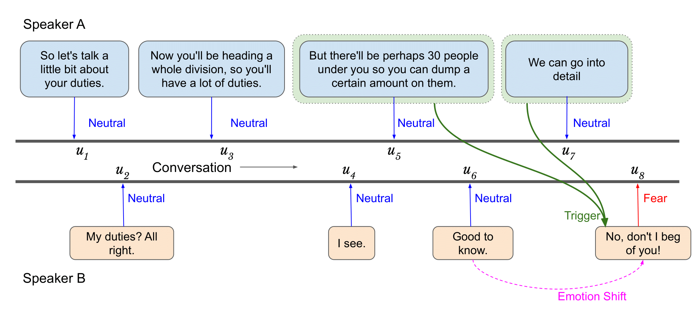
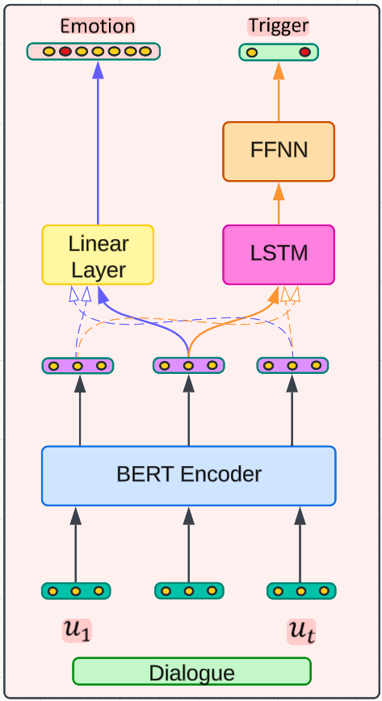
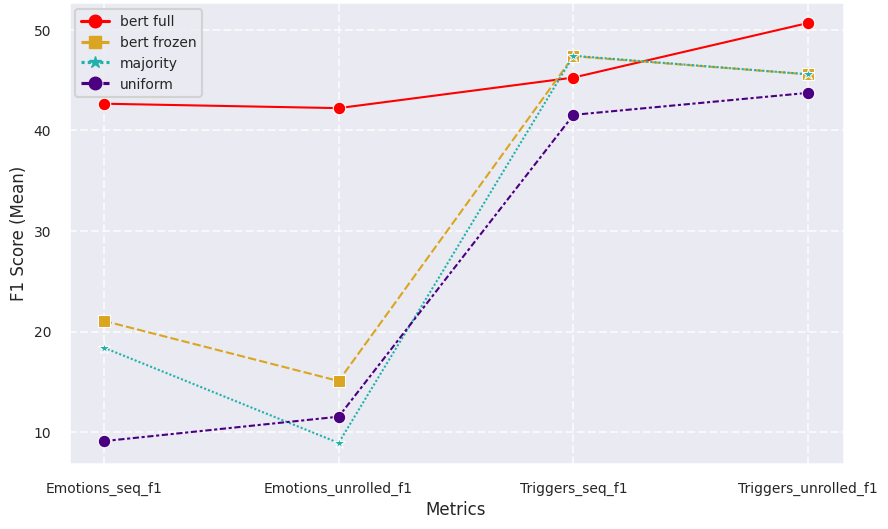

# Evolving Emotions in Conversation: Emotion and Trigger Prediction with Multi-Task Learning
Emotion Discovery and Reasoning its Flip in Conversation (EDiReF), SemEval 2024 Task 10 SUBTASK iii (English dialogues only) 

The data contains 4000 short English dialogues: from 5 to 17 utterances.

SemEval 2024 Task 10, “EDiReF,” aims to advance human communication understanding by analyzing emotional shifts in English dialogues. By analyzing a dataset comprising 4,000 dialogues, researchers aim to identify the factors that influence emotional shifts, a BERT model is put to the test in two configurations: one in its initial state and another after undergoing extensive training. These BERT models are compared against simpler classifiers like random and majority classifiers. 

The evaluation process involves using metrics to measure how well these models can recognize emotions within dialogues. The findings underscore the effectiveness of the BERT model, particularly after fine-tuning, in discerning the intricate nuances of emotions within conversational contexts. Through rigorous analysis, it becomes evident that BERT outperforms the simpler classifiers, achieving higher accuracy and demonstrating superior performance metrics. This underscores the efficacy of BERT in complex emotion recognition tasks within conversational contexts.

## Data
"emotions":
[
   "neutral",
   "surprise",
   "neutral",
   "surprise",
   "neutral",
   "anger"
],

"utterances":
[
   "Yes that's right.",
   "Why?",
   "I tired attacking two women, did not work.",
   "What?!",
   "No, I mean it's okay, I mean, they're-they're my friends.",
   "In fact, I-I-I was married to one of them."
],

"triggers":
[
   0.0,
   0.0,
   1.0,
   0.0,
   1.0,
   1.0
]

    

## Modeling

We train and evaluate a BERT `bert-base-uncased` baseline on two different settings:

     - Freezed: we freeze the BERT embedding layer weights and fine-tune the classifier heads on top
     
     - Full: we fine-tune the whole model architecture. Make sure you set a small enough batch size. 
                We recommend 1.

We also evaluate a random and a majority classifier for emotions and triggers and report a comparison with the selected model(s) and the baselines.

    

## Metrics

We report the following metrics for model evaluation.

     Sequence F1: compute the f1-score for each dialogue and report the average score.

     Unrolled Sequence F1: flatten all utterances and compute the f1-score.

We compute the above metrics for emotions and triggers labels.

To assess model robustness and report a sound evaluation, we train and evaluate your model(s) on 5 different seeds.

* Figure below demonstrates the summary of the experimantal results.

    

